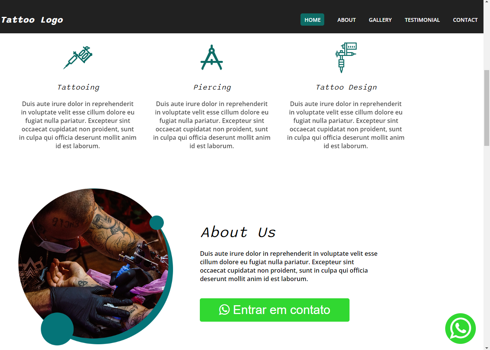
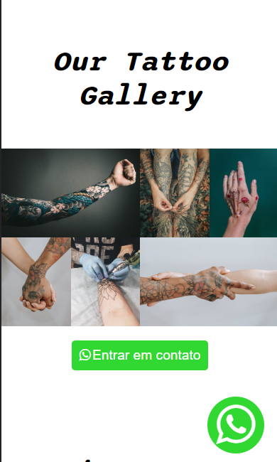

 <h1 align="center">Tattoo Website</h1>

 <a href="#-layout">Layout  |</a> 
 <a href="#-tecnologia">Technology |</a> 
 <a href="#-project">Project |</a> 
 <a href="#memo-liceça">License</a> 

## 🎨 Layout

 
 

## 🚀 Tecnologias

This project was developed with the following technology:

- HTML
- CSS
- JavaScript
- Git and Github

## 💻 Project

Website to Tattoo.

Live preview: https://barbosathaissa.github.io/website-tattoo/

## :memo: Licença

This project is under the MIT license

 

Made with 💜 by myself : [My contact!] [contatothaissabarbosa@gmail.com]